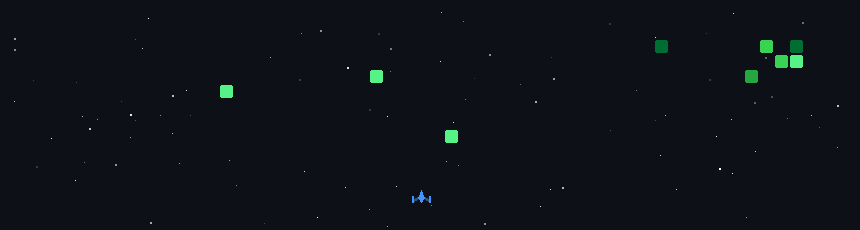

# Hi there!  I'm Manthan Dubey 👨‍💻 

  
   
  

I'm a passionate **Software Developer** and **Full Stack Developer** from India. I specialize in building web and mobile applications, focusing on performance, scalability, and user experience.

---

## 🌐 Connect with Me

---

## 🛠️ My Skills

  
  
  
  
  
  
  
  
  
  
  
  
  
  
  
  
  
  
  
  
  
  
  
  
  
  
  
  
  
  
  
  
  
  
  
  
  
  
  
  
  
  
  
  
  
  
  
  
  
  
  
  
  

---

  

